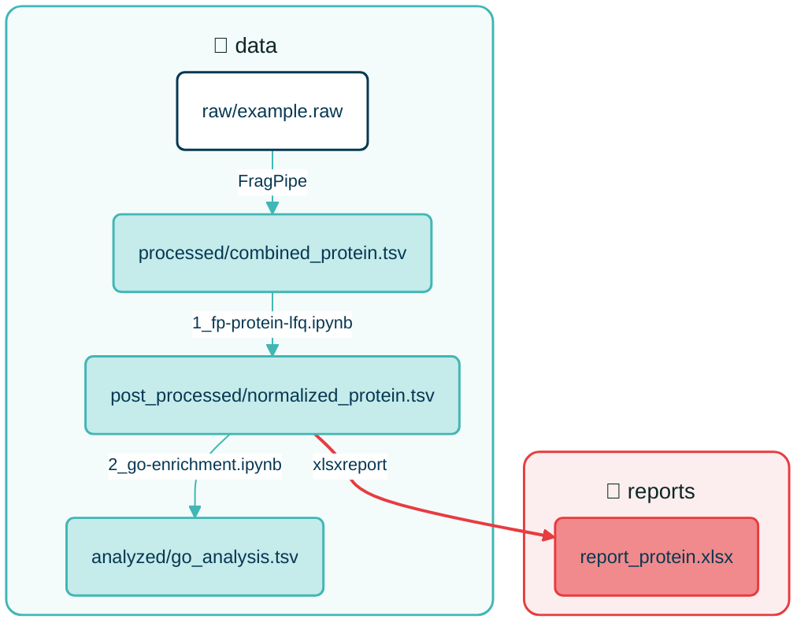

## Introduction

Our workflow for processing and analyzing mass spectrometry data shares core principles with standard data science pipelines. However, our use case presents two distinct operational differences:

- We generate our own raw data from instrument runs rather than working with pre-existing datasets
- Our primary objective is dataset quality control, basic data analysis, and clear outcome reporting rather than training predictive models

**Our Workflow**

1) Acquire raw MS data
2) Process raw MS data using search engines
3) Post-process search engine results to generate structured, ready-to-analyze data
4) Perform quality control and explore the results
5) _Optional: Conduct additional analysis_
6) Create a summary report and communicate the results

**Guiding Principle**

Similar to data science projects, maintaining robust documentation practices is vital for ensuring reproducibility. However, a standardized folder structure goes a long way toward making a project self-explanatory, allowing anyone to navigate it intuitively before diving into detailed documentation.

In line with the principle of *"good code is self-documenting"*, a well-designed project structure also serves as its own documentation. Given our goal to reduce the burden of explicit documentation during data processing, structural self-documentation is essential to our workflow. To promote self-documentation and reproducibility, we establish a standardized project structure template alongside rules and best practices for our data analysis process.

The project structure and many of the concepts and ideas presented here are inspired by [Cookiecutter Data Science](https://drivendata.github.io/cookiecutter-data-science/). Feel free to have a look if you're interested.

> *"... ultimately, data science code quality is about correctness and reproducibility."*

For a deeper, technical dive into organizing Python workflows and notebook structures, see Chris Moffitt's guide on [building a reproducible notebook process](https://pbpython.com/notebook-process.html).

## Project Structure

```text
project-directory/
├─ data               # Data files and processing results
│  ├─ external            # Additional reference data from outside sources
│  ├─ fasta               # FASTA files used in this project
│  ├─ raw                 # Raw instrument files
│  ├─ processed           # Primary search engine output (e.g. FragPipe or Spectronaut)
│  ├─ interim             # Optional: intermediate and temporary results
│  ├─ post_processed      # Post-processed tables (e.g., filtered, imputed, normalized matrices)
│  └─ analyzed            # Downstream output of final analysis (e.g. figures, enrichment results, etc.)
├─ notebooks          # Notebooks (Jupyter notebooks, R Markdown, etc.)
├─ src                # Optional: Code shared between notebooks
├─ reports            # Final deliverables for users (HTML reports, PDFs, etc.)
├─ references         # Optional: Material too extensive for readme
└─ README.md
```

The following illustration outlines the flow of data from the initial `data/raw/` directory to the final `data/analyzed/` and `reports/`. The `1_fp-protein-lfq.ipynb` notebook handles post-processing data while, the `xlsxreport` tool is used to generate the Excel report.



> In this example, there are no additional subfolders in the `data/` sub-directories or the `reports/` directory for simplicity, but in practice, you may have more complex structures with multiple subfolders for different types of analyses and reports.

## Guidelines

### Raw and processed data are immutable

All content of the `data/` directory should be treated as immutable. If multiple versions of processed data are necessary for analysis, save them separately.

> *"Don't ever edit your raw data. Especially not manually. And especially not in Excel."*
> <br> - Cookiecutter Data Science

Updates should only be made if the pipeline has to be re-run with different parameters. If manual editing is unavoidable, leave the original file completely untouched. Create a copy with a distinct suffix like `_manual-edit` and document the reason for the manual editing.

The code in the notebooks should move `processed/` data through a pipeline to `post_processed/`. You shouldn't have to run all of the post-processing steps every time you want to make a new analysis or figure. Instead, create a new notebook that imports data from the `post_processed/` directory and writes the desired output to the `analyzed/` directory.

### How to use Notebooks 

The data processing flow and logic should be contained within scripts, Jupyter Notebooks, or R Markdown files. Ideally, notebooks should focus on high-level processing logic, while complex or reusable code is offloaded to external libraries or standalone functions in `src/`. This keeps notebooks concise and their primary logic easy to comprehend.

Each notebook should serve a single, specific task and avoid being overloaded with additional functionality. For new or separate analytical steps, create a new notebook. This practice provides two main benefits:

1. Focused notebooks are easier to name, making their purpose immediately clear to outside reviewers.
2. Updating or adding an analytical step does not require re-running the entire pipeline.

**Naming Conventions**

Adhere to our standard naming convention, which reflects the sequence of the data analysis pipeline using the format `<step>_<description>.ipynb`. If multiple notebooks operate at the same level in the workflow hierarchy, introduce a substep hierarchy using `<step>-<substep>_`. Optionally, include a `_<suffix>` to include additional information about the notebook's purpose (e.g. `_no-imputation`).

Examples:

- `1_fp-protein-lfq.ipynb`
- `2-1_go-analysis.ipynb`
- `2-2_de-analysis.ipynb`
- `3-1_fig1-heatmap-go.ipynb`

**Exploratory Analysis**

Notebooks are well-suited for experimenting with alternative analysis methods before finalizing a workflow. Exploratory notebooks should be prefixed with `x-<step>_` (e.g., `x-1_clustering-test.ipynb`) and kept directly in `notebooks/` alongside the main pipeline. Keeping them in the root `notebooks/` directory avoids moving files into subfolders, which prevents breaking relative paths to `data/`.
